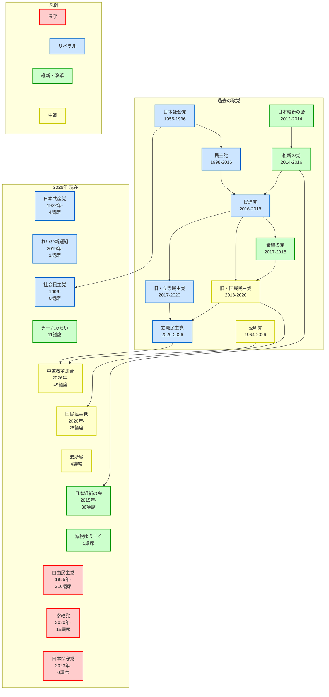

# political_party_trends

## 現在の主要政党

```mermaid
graph TD
    %% スタイル定義
    classDef conservative fill:#ffcccc,stroke:#ff0000,stroke-width:2px;
    classDef liberal fill:#cce5ff,stroke:#0066cc,stroke-width:2px;
    classDef reform fill:#ccffcc,stroke:#009900,stroke-width:2px;
    classDef centrist fill:#ffffcc,stroke:#cccc00,stroke-width:2px;

    %% 凡例
    subgraph Legend [凡例]
        direction LR
        LegCon[保守]:::conservative ~~~ LegLib[リベラル]:::liberal ~~~ LegRef[維新・改革]:::reform ~~~ LegCen[中道]:::centrist
    end

    %% レイアウト調整：凡例を最上部に固定
    LegCon ~~~ LDP
    LegLib ~~~ JSP
    LegRef ~~~ JIP_Old
    LegCen ~~~ DPP_Old

    %% 現在の主要政党
    subgraph Current [2026年 現在]
        direction LR
        LDP[自由民主党<br>1955年-<br>316議席]:::conservative
        CRU[中道改革連合<br>2026年-<br>49議席]:::centrist
        JIP[日本維新の会<br>2015年-<br>36議席]:::reform
        DPP[国民民主党<br>2020年-<br>28議席]:::centrist
        Sanseito[参政党<br>2020年-<br>15議席]:::conservative
        Mirai[チームみらい<br>11議席]:::reform
        JCP[日本共産党<br>1922年-<br>4議席]:::liberal
        Reiwa[れいわ新選組<br>2019年-<br>1議席]:::liberal
        Genzei[減税ゆうこく<br>1議席]:::reform
        SDP[社会民主党<br>1996-<br>0議席]:::liberal
        JCP_Con[日本保守党<br>2023年-<br>0議席]:::conservative
        Ind[無所属<br>4議席]:::centrist
        
        %% 並び順の強制（イデオロギー順：左派→右派）
        JCP ~~~ Reiwa ~~~ SDP ~~~ Mirai ~~~ CRU ~~~ DPP ~~~ Ind ~~~ JIP ~~~ Genzei ~~~ LDP ~~~ Sanseito ~~~ JCP_Con
    end

    %% 過去の政党
    subgraph Past [過去の政党]
        Komeito[公明党<br>1964-2026]:::centrist
        CDP[立憲民主党<br>2020-2026]:::liberal
        JSP[日本社会党<br>1955-1996]:::liberal
        DPJ[民主党<br>1998-2016]:::liberal
        JIP_Old[日本維新の会<br>2012-2014]:::reform
        JIP_Party[維新の党<br>2014-2016]:::reform
        DP[民進党<br>2016-2018]:::liberal
        Kibo[希望の党<br>2017-2018]:::reform
        CDP_Old[旧・立憲民主党<br>2017-2020]:::liberal
        DPP_Old[旧・国民民主党<br>2018-2020]:::centrist
    end

    %% 流れ
    JSP --> SDP
    JSP --> DPJ
    DPJ --> DP
    JIP_Old --> JIP_Party
    JIP_Party --> JIP
    JIP_Party --> DP
    DP --> CDP_Old
    DP --> Kibo
    DP --> DPP_Old
    Kibo --> DPP_Old
    CDP_Old --> CDP
    DPP_Old --> CDP
    DPP_Old --> DPP
    CDP --> CRU
    Komeito --> CRU
```