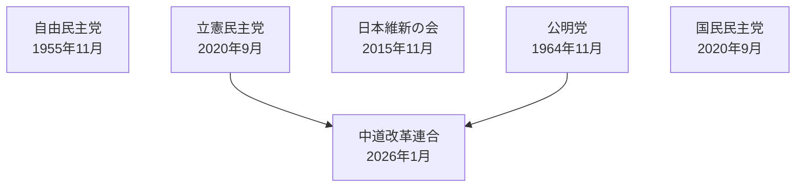

# political_party_trends

## 現在の主要政党

```mermaid
graph TD
    LDP[自由民主党<br>1955年11月]
    CDP[立憲民主党<br>2020年9月]
    JIP[日本維新の会<br>2015年11月]
    Komeito[公明党<br>1964年11月]
    DPP[国民民主党<br>2020年9月]

    CRU[中道改革連合<br>2026年1月]
    CDP --> CRU
    Komeito --> CRU
```